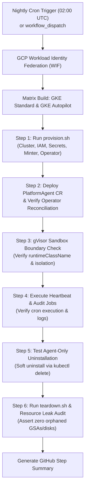

# GitHub Issue Draft (DO NOT SUBMIT YET)

**Title:** `ci: implement nightly E2E core infrastructure, sandbox isolation & provisioning/teardown regression tests on GKE`

---

## 🎯 Problem & Motivation

As `kube-agents` adoption expands across more operational environments, maintaining high core infrastructure quality and release stability is paramount. Currently, CI workflows validate unit code (`k8s-operator-test.yml`), Docker image builds (`docker-build.yml`), and static formatting (`prettier.yml`). However, there is no automated end-to-end (E2E) validation testing the full 10-step infrastructure provisioning, uninstallation, and teardown pipeline on real GKE clusters.

Testing must focus on **infrastructure reliability, operator CRD status reconciliation, gVisor security boundaries, GKE Autopilot compatibility, heartbeat execution, agent-only uninstallation, and full resource teardown**.

---

## 🚀 Proposed Solution

Implement a scheduled nightly GitHub Action workflow (`.github/workflows/nightly-gke-e2e-test.yml`) that executes every night (e.g., `0 2 * * *` UTC) on real, isolated GKE clusters in project `gca-gke-test`.

The workflow will test core infrastructure without chat platform dependencies:

1. **Matrix Provisioning**:
   - Run full 10-stage `k8s-operator/scripts/provision.sh` across a matrix of **GKE Standard** and **GKE Autopilot** clusters.
2. **PlatformAgent CRD & Pod Health**:
   - Deploy `PlatformAgent` CR and verify the Operator controller reconciles it to `Ready` status.
   - Verify pod volume mounts (PVC / GCS FUSE), Workload Identity bindings, and secret injections.
3. **gVisor Sandbox Boundary Enforcement**:
   - Validate that agent execution pods run under `runtimeClassName: gvisor` and cannot access host kernel/PID namespaces.
4. **Heartbeat Execution & Background Audits**:
   - Trigger a simulated background heartbeat run (`HEARTBEAT.md`) and verify scheduled cron audit scripts (`github-issue-resolver`, `policy-propagation`, `compliance-audit`) execute without `CrashLoopBackOff`.
5. **Agent-Only Uninstallation Validation (Soft Teardown)**:
   - Validate removing `PlatformAgent` CRD/secrets via `kubectl delete platformagent platform` leaves GKE cluster infrastructure intact and healthy.
6. **Full Teardown & Resource Leak Audit**:
   - Execute `k8s-operator/scripts/teardown.sh`.
   - Assert zero orphaned GCP resources (GSAs, KMS keyrings, Pub/Sub topics, unattached disks) remain post-teardown.

---

## 🛠 Workflow Architecture

---

## 📋 Implementation Checklist

- [ ] Configure WIF Service Account permissions for `gca-gke-test`.
- [ ] Create `.github/workflows/nightly-gke-e2e-test.yml` with matrix testing (GKE Standard / Autopilot).
- [ ] Add `gVisor` runtime isolation verification assertion script.
- [ ] Add heartbeat smoke test script (`HEARTBEAT.md` execution check).
- [ ] Add Agent-Only uninstallation test (`kubectl delete platformagent platform` verification).
- [ ] Add post-teardown resource leak auditor (`gcloud` assertion script for leftover GSAs, disks, and topics).
- [ ] Document workflow in `docs/` and add test status badge to `README.md`.
